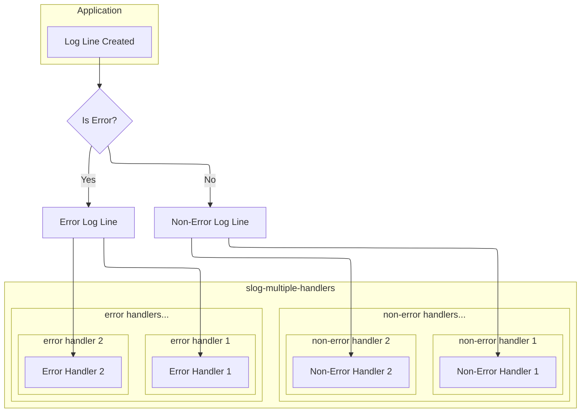

# slog multiple handlers
[](https://codecov.io/gh/tek-shinobi/slog-multiple-handlers)
[](https://goreportcard.com/report/github.com/tek-shinobi/slog-multiple-handlers)


## 🙆‍♀️ The Why?
Slog is a great logging library, but it has a limitation: it can only route logs to one handler.

## 🎉 Use this package to:
- ✅ Route logs to multiple handlers
- ✅ Allow routing of error logs to specified handlers
- ✅ Allow routing of non-error logs to specified handlers

## 🚀 Install

```sh
go get github.com/tek-shinobi/slog-multiple-handlers
```

## 🔮 The How?


## 📚 Usage
### Example 1: 
 - Non-error logs goto `stdout` 
 - Error logs goto `stderr` 

### Example 2:
- All logs goto `stdout`
- Error logs goto `stderr` 


```go
package main

import (
	"errors"
	"log/slog"
	"os"

	slogmultiplehandlers "github.com/tek-shinobi/slog-multiple-handlers"
)

func main() {
	example1()
	example2()
}

// example1 demonstrates how to route logs to different handlers
func example1() {
	outputHandler := slog.NewJSONHandler(os.Stdout, &slog.HandlerOptions{Level: slog.LevelInfo})
	errorOutputHandler := slog.NewJSONHandler(os.Stderr, &slog.HandlerOptions{Level: slog.LevelError})

	sMultiTargetHandler := slogmultiplehandlers.New().
		WithOutputHandlers(outputHandler).
		WithErrorOutputHandlers(errorOutputHandler)

	logger := slog.New(sMultiTargetHandler).WithGroup("example-1")
	logger.Info("info message", slog.String("key", "value"))
	logger.Error("error message", slog.Any("error", errors.New("error message")))

	// Output:
	// {"time":"2025-04-27T14:10:47.726913475+03:00","level":"INFO","msg":"info message","example-1":{"key":"value"}} <-- stdout
	// {"time":"2025-04-27T14:10:47.727040206+03:00","level":"ERROR","msg":"error message","example-1":{"error":"error message"}} <-- stderr
}

// example2 demonstrates how to route error+non-error logs to the same handler(outputHandler) as well as route error logs to a different handler
func example2() {
	outputHandler := slog.NewJSONHandler(os.Stdout, &slog.HandlerOptions{Level: slog.LevelInfo})
	errorOutputHandler := slog.NewJSONHandler(os.Stderr, &slog.HandlerOptions{Level: slog.LevelError})

	sMultiTargetHandler := slogmultiplehandlers.New().
		WithOutputHandlers(outputHandler).
		WithErrorOutputHandlers(outputHandler, errorOutputHandler)

	logger := slog.New(sMultiTargetHandler).WithGroup("example-2")
	logger.Info("info message", slog.String("key", "value"))
	logger.Error("error message", slog.Any("error", errors.New("error message")))

	// Output:
	// {"time":"2025-04-27T14:10:47.727054453+03:00","level":"INFO","msg":"info message","example-2":{"key":"value"}} <-- stdout
	// {"time":"2025-04-27T14:10:47.727057508+03:00","level":"ERROR","msg":"error message","example-2":{"error":"error message"}} <-- stdout
	// {"time":"2025-04-27T14:10:47.727057508+03:00","level":"ERROR","msg":"error message","example-2":{"error":"error message"}} <-- stderr
}
```
